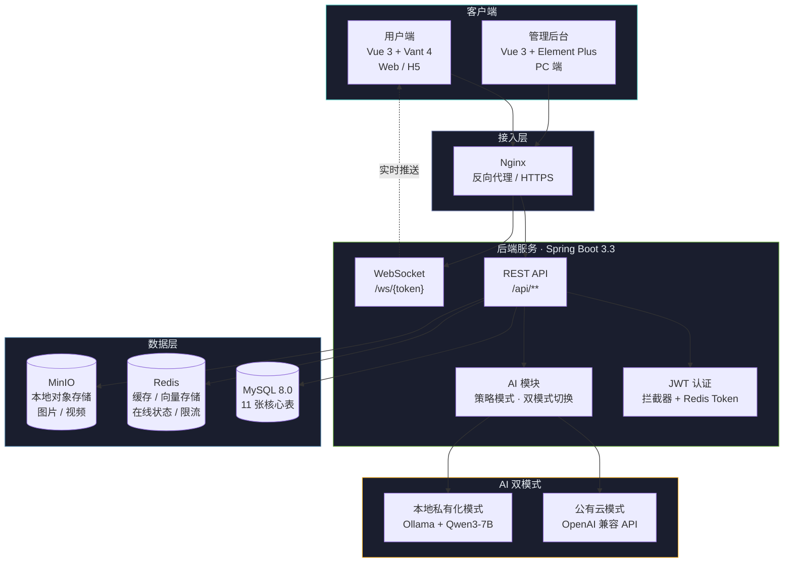

<div align="center">

<svg xmlns="http://www.w3.org/2000/svg" width="260" height="72" viewBox="0 0 260 72">
  <defs>
    <linearGradient id="hiveGrad" x1="0%" y1="0%" x2="100%" y2="100%">
      <stop offset="0%" stop-color="#4ECDC4"/>
      <stop offset="100%" stop-color="#2CB5AC"/>
    </linearGradient>
    <linearGradient id="amberDot" x1="0%" y1="0%" x2="100%" y2="100%">
      <stop offset="0%" stop-color="#FFB627"/>
      <stop offset="100%" stop-color="#F5A623"/>
    </linearGradient>
    <filter id="glow">
      <feGaussianBlur stdDeviation="2" result="blur"/>
      <feMerge>
        <feMergeNode in="blur"/>
        <feMergeNode in="SourceGraphic"/>
      </feMerge>
    </filter>
  </defs>
  <!-- Outer hexagon -->
  <polygon points="36,4 64,20 64,52 36,68 8,52 8,20"
           fill="url(#hiveGrad)" stroke="#3BB8B0" stroke-width="1.5" filter="url(#glow)"/>
  <!-- Inner hexagon cutout -->
  <polygon points="36,16 50,26 50,46 36,56 22,46 22,26"
           fill="#0D1117" stroke="none"/>
  <!-- Amber center dot -->
  <circle cx="36" cy="36" r="5" fill="url(#amberDot)" filter="url(#glow)"/>
  <!-- Small decorative hexagons -->
  <polygon points="12,10 18,7 18,13 12,16 6,13 6,7"
           fill="#4ECDC4" opacity="0.3"/>
  <polygon points="60,58 66,55 66,61 60,64 54,61 54,55"
           fill="#4ECDC4" opacity="0.3"/>
  <!-- Text: MintHive -->
  <text x="80" y="44" font-family="'Segoe UI', 'Helvetica Neue', Arial, sans-serif"
        font-size="32" font-weight="700" fill="#4ECDC4" letter-spacing="1.5">
    Mint<tspan fill="#FFB627">Hive</tspan>
  </text>
  <!-- Tagline -->
  <text x="82" y="60" font-family="'Segoe UI', 'Helvetica Neue', Arial, sans-serif"
        font-size="10" fill="#7A86B8" letter-spacing="3">
    INTEREST SOCIAL PLATFORM
  </text>
</svg>

<br/>

<a href="https://spring.io/projects/spring-boot" target="_blank">
  
</a>
<a href="https://vuejs.org/" target="_blank">
  
</a>
<a href="https://www.typescriptlang.org/" target="_blank">
  
</a>
<a href="https://www.mysql.com/" target="_blank">
  
</a>
<a href="https://redis.io/" target="_blank">
  
</a>
<a href="https://min.io/" target="_blank">
  
</a>
<a href="https://spring.io/projects/spring-ai" target="_blank">
  
</a>
<a href="https://developer.mozilla.org/en-US/docs/Web/API/WebSockets_API" target="_blank">
  
</a>
<a href="https://openjdk.org/" target="_blank">
  
</a>
<a href="https://github.com/your-org/Minthive/blob/main/LICENSE" target="_blank">
  
</a>
<a href="https://github.com/your-org/Minthive/pulls" target="_blank">
  
</a>

</div>

---

**MintHive** 是一个融合 AI 智能能力的垂直兴趣社交平台，名字取自 **Mint**（新鲜志趣）+ **Hive**（蜂巢聚合），寓意同兴趣爱好者相聚成团。平台主打「以兴趣聚合人群，以内容产生互动」，支持兴趣圈子社群、实时评论互动、AI 全链路辅助（发帖/评论/私信代聊/内容风控/千人千面推荐）、双重内容审核等核心能力，打造轻量化、高粘性、垂直化的兴趣交流社区。

---

## ▸ 核心功能

<table>
<tr>
<td width="50" align="center"><strong>◆</strong></td>
<td></td>
<td>
<b>AI 发帖助手</b> — 关键词一键生成 3 风格文案（简约/氛围感/干货）、文案润色纠错、敏感内容预检测<br/>
<b>AI 智能互动</b> — 贴合帖子内容生成自然评论、离线私信 AI 代回复（可撤回）<br/>
<b>AI 问答客服</b> — 全局悬浮入口，SSE 流式输出，7x24 小时自动应答
</td>
</tr>
<tr>
<td align="center"><strong>◇</strong></td>
<td></td>
<td>
圈子广场分类浏览与搜索、公开圈一键加入/私密圈审核制、圈主管理（置顶/公告/成员审核）、AI 圈子智能推荐
</td>
</tr>
<tr>
<td align="center"><strong>▸</strong></td>
<td></td>
<td>
基于 WebSocket 长连接：评论/回复实时推送、点赞收藏即时同步、一对一私信实时收发与已读回执、系统/圈子公告全员推送
</td>
</tr>
<tr>
<td align="center"><strong>●</strong></td>
<td></td>
<td>
AI 兴趣向量动态更新、个性化信息流推荐（智能/最新/最热三模式）、AI 圈子与好友智能匹配、用户行为日志驱动推荐迭代
</td>
</tr>
<tr>
<td align="center"><strong>■</strong></td>
<td></td>
<td>
敏感词库 + AI 语义双重审核（识别谐音/变体/暗语）、AI 图片违规识别（本地检测不外传）、举报工单 AI 风险等级自动分拣、内容驳回原因推送
</td>
</tr>
<tr>
<td align="center"><strong>▹</strong></td>
<td></td>
<td>
用户管理（封禁/解封/密码重置/僵尸清理）、内容审核（待审/已发布/敏感词库）、圈子管理、举报工单处理、系统配置、数据大屏（ECharts 可视化 + AI 日报 + Excel 导出）、AI 功能全局/单项开关
</td>
</tr>
</table>

---

## ▸ 系统架构



---

## ▸ 快速上手

### ◆ 环境要求

| 组件 | 版本 | 说明 |
|------|------|------|
| JDK | 17+ | 后端运行环境 |
| Maven | 3.8+ | 后端构建工具 |
| Node.js | 18+ | 前端运行环境 |
| MySQL | 8.0+ | 主数据库 |
| Redis | 6.0+ | 缓存 / 向量存储 / 在线状态 |
| MinIO | 最新稳定版 | 本地对象存储 |
| Ollama | 最新版（可选） | 本地大模型服务 |

### ◆ 五步启动

**01** 克隆仓库

```bash
git clone https://github.com/your-org/Minthive.git
cd Minthive
```

**02** 启动中间件

```bash
# MySQL — 创建数据库并初始化
mysql -uroot -p < backend/docs/sql/init.sql

# Redis
redis-server --port 6379

# MinIO
minio server /data/minio --console-address ":9001"
# 访问 http://localhost:9001 创建存储桶 minthive
```

**03** 配置后端

```bash
cd backend
cp .env.example .env
# 编辑 .env 填入 MySQL / Redis / MinIO / JWT / AI 实际配置
```

**04** 启动后端

```bash
cd backend
mvn spring-boot:run
# 服务启动于 http://localhost:8080
# 接口文档 http://localhost:8080/doc.html
```

**05** 启动前端

```bash
# 用户端
cd frontend-user
npm install
npm run dev
# 访问 http://localhost:5173

# 管理后台
cd frontend-admin
npm install
npm run dev
# 访问 http://localhost:5174
```

> 详细部署说明请参阅 [部署手册](backend/docs/部署手册.md)

---

## ▸ 项目结构

```
Minthive/
├── backend/                          # Spring Boot 后端
│   ├── src/main/java/com/minthive/
│   │   ├── ai/                       # AI 双模式服务（策略模式 + 限流 + 缓存 + 降级）
│   │   ├── config/                   # 配置类（CORS / JWT / MinIO / Redis / WebSocket / AI）
│   │   ├── common/                   # 通用模块（Result / 异常处理 / 常量 / 错误码）
│   │   ├── controller/               # 用户端 REST 控制器（11 个）
│   │   ├── controller/admin/         # 管理端 REST 控制器（6 个）
│   │   ├── entity/                   # MyBatis-Plus 数据实体（11 张表映射）
│   │   ├── mapper/                   # Mapper 接口 + XML（含 5 个管理端自定义 SQL）
│   │   ├── security/                 # JWT 认证（拦截器 / 工具 / ThreadLocal 上下文）
│   │   ├── service/                  # 业务服务接口（12 个）
│   │   ├── service/impl/             # 业务服务实现（11 个）
│   │   ├── util/                     # 工具类（Redis / MinIO / 敏感词 DFA / BCrypt / 图片压缩）
│   │   └── websocket/                # WebSocket 服务（消息类型 / 推送 / 在线管理）
│   ├── src/main/resources/
│   │   ├── application.yml           # 基础配置
│   │   ├── application-dev.yml       # 开发环境配置
│   │   ├── application-prod.yml      # 生产环境配置
│   │   ├── sensitive-words.txt       # 敏感词库
│   │   └── mapper/                   # MyBatis XML
│   ├── docs/
│   │   ├── sql/init.sql              # 数据库初始化脚本
│   │   ├── sql/test_data.sql         # 测试数据
│   │   ├── 部署手册.md                # 完整部署文档
│   │   └── 接口文档.md                # 接口详细文档
│   └── pom.xml
│
├── frontend-user/                    # Vue 3 用户端（Web + H5）
│   └── src/
│       ├── api/                      # API 模块（12 个，含 AI 接口 + SSE 流式）
│       ├── views/                    # 页面组件（14 个路由页面）
│       │   ├── home/                 # 首页信息流（瀑布流 / 三模式切换）
│       │   ├── post/                 # 发帖（AI 内联工具栏）+ 帖子详情
│       │   ├── circle/               # 圈子广场 + 圈子详情
│       │   ├── message/              # 消息中心 + 私信聊天（AI 代回复）
│       │   ├── profile/              # 个人主页 + 我的
│       │   ├── login/                # 登录注册
│       │   ├── interest/             # 兴趣标签选择
│       │   ├── search/               # 全局搜索
│       │   ├── settings/             # 设置（AI 开关 / 主题 / 通知）
│       │   └── error/                # 404
│       ├── stores/                   # Pinia 状态管理（app / user / chat）
│       ├── components/               # 通用组件（11 个）
│       │   ├── AiAssistant.vue       # 全局 AI 问答悬浮窗（SSE 流式打字机效果）
│       │   ├── PostCard.vue          # 帖子卡片（AI 生成标记）
│       │   ├── CommentItem.vue       # 评论项（楼中楼 + AI 标记）
│       │   └── ...                   # NavBar / TabBar / UserCard / CircleCard 等
│       ├── utils/                    # 工具（WebSocket 客户端 / 图片压缩 / 格式化）
│       ├── styles/                   # SCSS（变量 / 动画 / 全局样式）
│       └── types/                    # TypeScript 类型定义
│
├── frontend-admin/                   # Vue 3 管理后台（PC 端）
│   └── src/
│       ├── views/                    # 管理页面（7 个）
│       │   ├── dashboard/            # 数据大屏（6 统计卡 + 6 ECharts 图 + AI 日报）
│       │   ├── user/                 # 用户管理
│       │   ├── content/              # 内容审核（待审 / 已发布 / 敏感词库）
│       │   ├── circle/               # 圈子管理
│       │   ├── report/               # 举报工单（AI 风险等级排序）
│       │   ├── config/               # 系统配置（公告 / 轮播 / 规则 / AI 开关）
│       │   └── login/                # 管理员登录
│       ├── components/               # 通用组件（8 个）
│       │   ├── ChartCard.vue         # ECharts 封装
│       │   ├── StatCard.vue          # 指标卡（数字滚动动画）
│       │   ├── AiReportCard.vue      # AI 日报卡（SVG 环形健康分）
│       │   ├── RiskLevelTag.vue      # 风险等级标签（脉冲动画）
│       │   └── ...                   # DataTable / StatusTag / HexagonLogo 等
│       ├── layouts/                  # AdminLayout（侧边栏 + 顶栏）
│       ├── stores/                   # Pinia（admin / stats）
│       └── styles/                   # SCSS（暗色主题 + Element Plus 覆写）
│
├── docs/                             # 项目文档
│   └── PulseSocial 兴趣社交平台开发软件需求规格说明书（SRS）.md
│
└── deploy/                           # 部署配置（待填充）
```

---

## ▸ API 概览

### ◆ 用户端 API（`/api/**`）

| 模块 | 路径前缀 | 核心端点 | 认证 |
|------|----------|----------|------|
| Auth | `/api/auth` | 登录 / 注册 / 短信验证码 / 重置密码 / 登出 | 公开 |
| User | `/api/user` | 个人信息 / 修改资料 / 头像 / 兴趣标签 / 注销 | Token |
| Post | `/api/post` | 发布 / 详情 / 信息流 / 点赞 / 收藏 / 转发 / 草稿 | Token |
| Comment | `/api/comment` | 发表评论 / 帖子评论列表 / 删除 / 点赞 | Token |
| Circle | `/api/circle` | 圈子列表 / 详情 / 加入 / 离开 / 创建 / 分类 | 部分 |
| Circle Admin | `/api/circle-admin` | 圈主管理 / 成员移出 / 公告发布 | 圈主 |
| Message | `/api/message` | 发送私信 / 聊天记录 / 已读 / AI 消息撤回 / 通知 | Token |
| Follow | `/api/follow` | 关注 / 取关 / 关注列表 / 粉丝列表 / AI 推荐好友 | Token |
| Search | `/api/search` | 全局搜索 / 用户 / 帖子 / 圈子 / 热词 | 公开 |
| AI | `/api/ai` | 文案生成 / 润色 / 评论 / 私信代回复 / 内容检测 / 问答流式 / 推荐 | Token |
| File | `/api/file` | 文件上传（图片 / 视频 → MinIO） | Token |
| Report | `/api/report` | 提交举报（5 种违规类型） | Token |

### ◇ 管理端 API（`/api/admin/**`）

| 模块 | 路径前缀 | 核心端点 |
|------|----------|----------|
| User | `/api/admin/user` | 用户列表 / 详情 / 封禁 / 解封 / 密码重置 / 僵尸清理 |
| Stats | `/api/admin/stats` | 核心指标 / 趋势 / 圈子排行 / AI 日报 / Excel 导出 |
| Content | `/api/admin/content` | 待审列表 / 已发布列表 / 审批 / 驳回 / 删除 / 敏感词管理 |
| Report | `/api/admin/report` | 工单列表 / 详情 / 驳回 / 删除内容 / 处罚用户 |
| Circle | `/api/admin/circle` | 圈子列表 / 申请审核 / 下架 / 编辑 / 推荐 / 权限转让 |
| Config | `/api/admin/config` | 公告 / 轮播 / 平台规则 / 操作员 / AI 功能开关 |

---

## ▸ AI 双模式部署

MintHive 的 AI 模块采用 **策略模式** 设计，支持一键切换部署模式，无需改动代码：

| 模式 | 配置 | 适用场景 |
|------|------|----------|
| **Cloud** | `ai.mode=cloud` + API Key | 有外网环境，调用 OpenAI 兼容 API（DeepSeek / GPT 等） |
| **Local** | `ai.mode=local` + Ollama | 内网私有化部署，Ollama + Qwen3-7B，数据不出内网 |

```yaml
# application.yml — 切换仅需修改此配置
ai:
  mode: cloud          # cloud | local
  cloud:
    base-url: https://api.openai.com
    api-key: ${AI_CLOUD_API_KEY}
    model: gpt-4o-mini
  local:
    base-url: http://localhost:11434
    model: qwen3:7b
```

**AI 基础设施：**

| 组件 | 说明 |
|------|------|
| AiContext | 策略选择器，根据 `ai.mode` 路由至 Cloud/Local 实现 |
| AiRateLimiter | Redis 令牌桶，每用户每日 50 次，午夜自动重置 |
| AiCacheManager | Redis 缓存 AI 响应（参数哈希键，可配 TTL） |
| AiFallback | 降级处理器，AI 服务异常时返回兜底文案，不阻塞基础业务 |

---

## ▸ 界面预览

<!-- TODO: 替换为实际截图路径 -->

<table>
<tr>
<td align="center" width="50%">
<b>首页信息流</b><br/>
<i>瀑布流布局 · 智能推荐/最新/最热三模式切换</i>
</td>
<td align="center" width="50%">
<b>圈子广场</b><br/>
<i>分类浏览 · 搜索 · AI 圈子推荐 · 加入/申请</i>
</td>
</tr>
<tr>
<td align="center">
首页信息流截图占位</div>'"/>
</td>
<td align="center">
圈子广场截图占位</div>'"/>
</td>
</tr>
<tr>
<td align="center">
<b>私信聊天</b><br/>
<i>WebSocket 实时消息 · AI 代回复 · 已读回执</i>
</td>
<td align="center">
<b>管理后台数据大屏</b><br/>
<i>ECharts 可视化 · AI 日报 · Excel 导出</i>
</td>
</tr>
<tr>
<td align="center">
私信聊天截图占位</div>'"/>
</td>
<td align="center">
管理后台截图占位</div>'"/>
</td>
</tr>
</table>

---

## ▸ 技术亮点

| 维度 | 实现 |
|------|------|
| **AI 解耦** | 策略模式双模式切换，Cloud/Local 零代码切换，降级不阻塞业务 |
| **实时通信** | 原生 WebSocket + Redis 在线追踪，11 种消息类型全覆盖 |
| **认证安全** | JWT + Redis Token 双校验，BCrypt 自适应加盐加密，无 MD5 遗留 |
| **风控体系** | DFA 敏感词算法 + AI 语义复审，识别谐音/变体/暗语，图片本地 AI 检测 |
| **限流防护** | Redis 令牌桶限流：AI 50次/日、发帖 50次/日、评论 200次/日、私信 100次/日 |
| **文件存储** | MinIO 本地私有化存储，图片自动压缩，无第三方云依赖 |
| **前端工程** | Vue 3 + Vite + TypeScript，Pinia 持久化状态，WebSocket 自动重连心跳 |
| **管理后台** | ECharts 暗色主题可视化，SVG 环形/滚动数字动画，XLSX 多 Sheet 导出 |

---

## ▸ 贡献指南

感谢你对 MintHive 的关注！欢迎通过以下方式参与贡献：

1. **Fork** 本仓库到你的 GitHub 账号
2. 创建特性分支：`git checkout -b feature/your-feature`
3. 提交变更：`git commit -m 'feat: add your feature'`
4. 推送分支：`git push origin feature/your-feature`
5. 提交 **Pull Request**，描述变更内容与关联 Issue

提交规范建议遵循 [Conventional Commits](https://www.conventionalcommits.org/)：

| 前缀 | 用途 |
|------|------|
| `feat:` | 新功能 |
| `fix:` | 修复 Bug |
| `docs:` | 文档更新 |
| `style:` | 代码格式调整 |
| `refactor:` | 重构 |
| `perf:` | 性能优化 |
| `test:` | 测试相关 |

---

## ▸ License

本项目基于 [MIT License](LICENSE) 开源。

---

## ▸ 致谢

<table>
<tr>
<td align="center">
<a href="https://spring.io/projects/spring-boot" target="_blank"><b>Spring Boot</b></a><br/>
<span style="font-size:12px;color:#7A86B8">后端框架</span>
</td>
<td align="center">
<a href="https://vuejs.org/" target="_blank"><b>Vue.js</b></a><br/>
<span style="font-size:12px;color:#7A86B8">前端框架</span>
</td>
<td align="center">
<a href="https://baomidou.com/" target="_blank"><b>MyBatis-Plus</b></a><br/>
<span style="font-size:12px;color:#7A86B8">ORM 增强</span>
</td>
<td align="center">
<a href="https://spring.io/projects/spring-ai" target="_blank"><b>Spring AI</b></a><br/>
<span style="font-size:12px;color:#7A86B8">AI 集成框架</span>
</td>
<td align="center">
<a href="https://ollama.com" target="_blank"><b>Ollama</b></a><br/>
<span style="font-size:12px;color:#7A86B8">本地大模型</span>
</td>
<td align="center">
<a href="https://github.com/QwenLM/Qwen3" target="_blank"><b>Qwen3</b></a><br/>
<span style="font-size:12px;color:#7A86B8">开源大语言模型</span>
</td>
</tr>
</table>

<br/>

<div align="center">
<sub>Built with </sub><b style="color:#4ECDC4">Mint</b><sub> fresh ideas · United in the </sub><b style="color:#FFB627">Hive</b>
</div>
